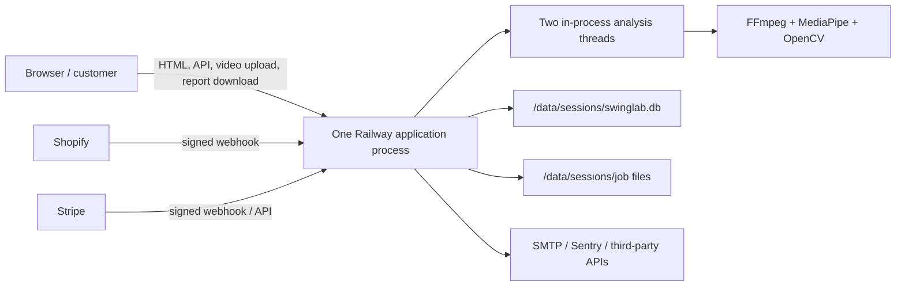
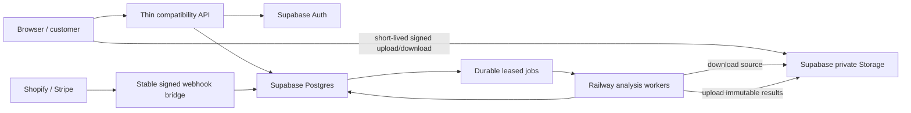

# CaddieInsight Railway platform and cost audit

<!-- markdownlint-disable MD013 MD060 -->

**Status:** Stage 0A live-account evidence complete; Stage 0B repository
foundation prepared and inactive

**Audit date:** 2026-07-27

**Repository snapshot:** `origin/main` at `7d79a47`

**Railway measurement window:** 2026-07-28 01:59–02:08 UTC
(2026-07-27 21:59–22:08 EDT)

**Production changes made:** None

## Executive summary

CaddieInsight is currently implemented as one stateful Python application image. The
same process serves the website and API, receives Shopify and Stripe webhooks,
authenticates users, sends optional email digests, and runs up to two concurrent
video-analysis jobs. Its durable relational state is one SQLite database and its
job inputs and outputs are local files, all rooted at `/data/sessions`.

The public production health endpoint, GitHub deployment metadata, and a
read-only review of the signed-in Railway dashboard confirm the live topology.
The internal Railway project `desirable-spontaneity` has one production service,
`SwingLab`, connected to `main` with automatic deployments enabled. It runs one
replica in US East (Virginia), has no custom start-command override, and has one
5 GB volume mounted at `/data`.

The most important conclusions are:

1. **The analysis pipeline belongs on Railway for now.** FFmpeg, MediaPipe,
   OpenCV, NumPy, and report rendering are the CPU- and memory-intensive,
   native-library workloads Railway is well suited to run.
2. **The current persistence model is the scaling boundary.** SQLite, local
   artifacts, an in-process executor, and process-local locks prevent safe
   horizontal replication.
3. **There is currently no Railway volume backup.** The live Backups page says
   "No Backups"; the Hobby workspace exposed no backup controls. Stage 0B adds
   inert WAL-safe snapshot, artifact-manifest, private S3-compatible transport,
   and scratch-restore tooling, but configures no storage, credentials,
   schedule, production backup, or restore point.
4. **Supabase is a reasonable future home for durable relational state,
   authentication, and private objects, but not for the analysis engine.**
5. **The migration should optimize for recoverability, not immediate savings.**
   Running both platforms during shadow and soak periods will probably add
   approximately $25–$30 per month before usage overages. Railway savings appear
   only after local storage and file delivery are actually removed; analysis CPU
   remains.
6. **No multi-replica Railway deployment should be attempted before durable job
   leases, shared relational state, and object storage are authoritative.**

The safest destination is Railway primarily running idempotent analysis workers,
with Supabase providing Postgres, Auth, and private object storage. A thin,
stateless compatibility API and webhook bridge may remain on Railway until all
existing public contracts are proven elsewhere.

## Scope and evidence boundaries

Railway account evidence collection was read-only. Stage 0B changes repository
code, documentation, workflows, and synthetic tests only; it did not change or
run tooling against infrastructure, databases, deployments, settings, DNS,
secrets, volumes, or production data.

### Evidence used

- The repository at `7d79a47`, including the
  [`Dockerfile`](../../Dockerfile), [`config.yaml`](../../config.yaml),
  [`swinglab/web`](../../swinglab/web), and
  [`deploy/README.md`](../../deploy/README.md).
- GitHub deployment metadata showing successful Railway production deployments
  from the repository.
- A read-only request to `https://app.caddieinsight.com/healthz` at
  2026-07-28 01:14 UTC. It returned HTTP 200:

  ```json
  {"status":"ok","queued":0,"processing":0,"disk_free_mb":4576,"sessions_count":1}
  ```

- A read-only signed-in Railway dashboard review from 2026-07-28 01:59 to
  02:08 UTC (2026-07-27 21:59 to 22:08 EDT). No forms were submitted and no
  settings, variables, deployments, replicas, volumes, backups, or data were
  changed.
- The inactive Stage 0B implementation in
  [`swinglab/backups`](../../swinglab/backups), its synthetic-only tests, and
  the [backup and recovery runbook](../operations/backup-recovery.md). These
  repository artifacts were reviewed without running them against production.
- Current official Railway and Supabase documentation, linked in
  [Sources](#sources).

The health response confirms that the application is alive on Railway and that
the running application can see the sessions filesystem. It is a point-in-time
application observation, not a billing, backup, topology, or capacity report.
The `sessions_count` field counts application job records; it is not a count of
active customers.

### Stage 0A live Railway evidence

No dashboard screenshots were committed because the required evidence can be
reproduced from the dashboard locations below without adding account imagery to
the repository.

| Item | Verified fact | Railway dashboard location |
|---|---|---|
| Plan and estimate | Hobby plan. For the Jul 23–Aug 23 billing period, Current Usage was `$0.34`, Estimated Bill was `$1.59`, and Current Bill was `$0.34` at measurement time. | Workspace **Usage** |
| Project inventory | One project, internal name `desirable-spontaneity`, production environment. Dashboard showed `1/1 service online`. | **Projects** → `desirable-spontaneity` → `production` → **Architecture** |
| Service inventory | Exactly one service: `SwingLab`, online at `app.caddieinsight.com`. One attached volume: `swinglab-volume`. | Project **Architecture** |
| Deployment source | GitHub repository `kylejames0513-bot/SwingLab`; production branch `main`. | `SwingLab` → **Settings** → **Source** |
| Automatic deployment | Enabled. The page says changes to `main` are automatically pushed to production and shows `Auto deploys when pushed to GitHub`; the available action is **Disable**. | `SwingLab` → **Settings** → **Source** |
| Builder/start command | Dockerfile builder automatically detected. The Custom Start Command editor is blank, so there is no Railway start-command override. The image `CMD` remains the runtime contract. | `SwingLab` → **Settings** → **Build** / **Deploy** → **Custom Start Command** |
| Replica and region | Exactly one replica in `US East (Virginia, USA)`. The replica field is disabled and Railway says replicas are unavailable for attached volumes. | `SwingLab` → **Settings** → **Scale** → **Regions & Replicas** |
| Resource limits | Per-replica configured maxima: `8 vCPU` and `8 GB` RAM, each also shown as the Hobby plan limit. These are caps, not reservations or observed use. | `SwingLab` → **Settings** → **Scale** → **Replica Limits** |
| Volume | `swinglab-volume`, mounted at `/data`, maximum size `5.00 GB`, in `US East (Virginia, USA)`. Latest visible usage sample: `171.9 MB` at 2026-07-27 16:00 EDT. | `swinglab-volume` → **Settings** / **Metrics** |
| Backups | None. The page says `No Backups` and `This service's volume does not have any backups.` Backups/PITR require Pro. Last successful backup and retention are therefore not applicable. | `SwingLab` → **Backups** |
| Single-replica mount check | Confirmed: production has one `SwingLab` replica and the only attached volume is mounted at `/data`. | Project **Architecture**, `SwingLab` **Settings**, and `swinglab-volume` **Settings** |

### Available metric history

Railway exposes a **30d** selector, but this project currently has dashboard
observations only from July 23 through July 27. The values below are the
available evidence, not a full 30-day baseline. Where the 30-day graph was too
compressed for a precise tooltip, the 7-day hourly view was used over the same
available dates and is labeled accordingly.

| Meter | Observed evidence | Dashboard location |
|---|---|---|
| CPU | 30-day graph is populated only near Jul 23–27. A readable hourly sample reached `0.1 vCPU` at Jul 25 17:00 EDT; the Jul 27 19:00 EDT sample rounded to `0.0 vCPU`. | `SwingLab` → **Metrics** → **30d**; **7d** for hourly tooltips |
| Memory | 30-day tooltip sample: `1.16 GB` at Jul 25 16:00 EDT. Latest readable hourly sample: `144.27 MB` at Jul 27 22:00 EDT. | `SwingLab` → **Metrics** → **30d**; **7d** for latest hourly tooltip |
| Disk | Volume maximum `5.00 GB`; latest volume-metric sample `171.9 MB` used at Jul 27 16:00 EDT. | `swinglab-volume` → **Settings** / **Metrics** → **30d** |
| Network | Billing-period cumulative egress was `0.23 GB` (`$0.0115`). A readable hourly ingress sample was `156.85 MB` at Jul 25 17:00 EDT; an egress sample was `41.76 kB` at Jul 27 20:00 EDT. | Workspace **Usage** and `SwingLab` → **Metrics** |
| Requests | `1.4K total` across the available Jul 23–27 data. | `SwingLab` → **Metrics** → **30d** |

### Remaining unknowns after Stage 0A

- A true 30-day average, p95, and growth trend do not yet exist; the available
  dashboard history spans only Jul 23–27.
- Per-analysis CPU-minutes, peak memory, input/output bytes, retry cost, and
  free-versus-Pro workload attribution are not instrumented.
- `$1.59` is Railway's current estimate, not an issued invoice; taxes,
  adjustments, credits, and usage after the measurement window can change it.
- Volume metrics lagged the audit clock: the latest visible disk point was
  16:00 EDT while the dashboard review ended after 22:00 EDT.
- There is no backup restore point to test. RPO, RTO, and restore correctness
  remain unmeasured until a backup system is implemented under a separately
  approved production change.

## 1. What Railway currently hosts and runs

### Repository-defined runtime

The production image contains Python 3.11, FFmpeg and native image/video
libraries, the `swinglab` Python package, and a MediaPipe pose model downloaded
at image-build time. Its repository-defined command is:

```text
swinglab serve --host 0.0.0.0 --port ${PORT:-8000} --sessions-dir /data/sessions
```

Railway supplies `PORT`; the application defaults to `8000` only when it is not
set. The image health check calls `/healthz` on that same port.

`swinglab serve` starts one Uvicorn/FastAPI process. The shipped
`web.workers: 2` setting creates two analysis threads inside that process; it
does **not** mean two Uvicorn workers or two Railway replicas.

Railway can override an image command, but the live Custom Start Command field
was blank during Stage 0A. The Dockerfile was automatically detected, so the
image `CMD` above is the current runtime contract.

### Responsibilities co-located in that process

| Responsibility | Current implementation |
|---|---|
| Customer website | FastAPI routes and server-rendered templates |
| JSON API | FastAPI routes in the same application |
| Authentication | Local users, scrypt password verification, email codes, and signed application sessions |
| Uploads | Request body copied in 1 MiB chunks to `/data/sessions/<job>/source.*` |
| Swing analysis | In-process `ThreadPoolExecutor`, maximum two concurrent jobs in shipped config |
| Media processing | FFprobe/FFmpeg, MediaPipe, OpenCV, Pillow, NumPy/SciPy |
| Reports and generated media | Created under each local session directory and served with authenticated `FileResponse` routes |
| Persistent job state and restart recovery | Rows in `/data/sessions/swinglab.db` plus the in-process executor; there are no distributed claim/ack/lease semantics |
| Purchase/entitlement ledger | SQLite tables for users, Pro grants, Shopify orders, gear orders, and Stripe-related account state |
| Shopify/Stripe webhooks | Received and verified by the same web process |
| Abuse throttling | SQLite-backed authentication attempts and application checks |
| Weekly digest | Optional hourly daemon thread in the same process when SMTP and the feature are enabled |
| Health/operations | `/healthz` reports queue depth, free disk, and job count |

### Current logical architecture



The live project Architecture page confirms this is the complete production
service inventory: one `SwingLab` service, one attached `swinglab-volume`, and
`1/1 service online`.

## 2. Resource consumption

Railway bills runtime CPU and memory by time, persistent volumes and backups by
stored data, and network egress by bytes. The following maps those meters to the
application.

| Runtime unit | CPU and memory | Storage and network |
|---|---|---|
| Uvicorn/FastAPI main process | Low steady baseline with request, template, auth, and SQLite bursts | Accepts uploads, serves private artifacts, and calls third parties |
| Two analysis executor threads | High and bursty; each drives a separate analysis pipeline | Reads source/work files and writes retained artifacts |
| FFprobe/FFmpeg subprocesses | Often the dominant CPU consumer; encoding/interpolation also raises peak RAM | Read/write large media and temporary frame/audio trees |
| MediaPipe/OpenCV/NumPy/Pillow code | Per-frame CPU plus one model/tracker and image buffers per active job | Produces metrics, frames, strips, overlays, and videos |
| Optional digest daemon thread | Low periodic CPU/RAM | Reads SQLite and sends small SMTP payloads |
| SQLite and session filesystem | Page-cache memory and short query bursts | All durable state, temporary work, retained outputs, and file delivery |

### CPU

The likely dominant CPU consumers are:

- Up to two simultaneous analysis pipelines.
- FFprobe/FFmpeg frame extraction, H.264 encoding, and slow-motion
  interpolation. FFmpeg can also use multiple native threads per job, so two
  application workers can oversubscribe a small CPU allocation.
- MediaPipe inference over extracted frames.
- OpenCV, Pillow, NumPy, and SciPy transforms and report visualization.
- Deliberately expensive scrypt password hashing during signup and password
  login.
- Lower, steady overhead from FastAPI/Uvicorn, SQLite queries, file serving,
  health checks, cleanup, and the optional digest scheduler.

The `fast` analysis mode and the existing free-tier replay gating avoid some of
the most expensive video-generation work. They reduce per-job CPU but do not
make jobs stateless.

### Memory

The likely memory consumers are:

- The resident Python application and imported scientific/native libraries.
- A MediaPipe tracker/model runtime and frame/landmark data for each active
  analysis.
- FFmpeg encoding and interpolation processes.
- Full-resolution image canvases used to render overlays and strips.
- SQLite page cache and small in-process caches.

Uploads are copied in bounded chunks, and audio processing is memory-mapped and
chunked, so entire upload bodies are not intentionally held in Python memory.
Peak memory should still be measured with two real analyses running
concurrently.

### Storage

Persistent storage under `/data/sessions` includes:

- `swinglab.db` and its SQLite WAL/SHM files.
- Source video while a job is queued or processing, up to the configured
  500 MB upload limit.
- Temporary extracted frames and audio during processing.
- Retained `report.html`, JSON metrics, images, overlays, slow-motion video,
  and optional annotated replay video.
- A sample report tree.

The shipped configuration deletes a source upload after the job reaches a
terminal state and a report exists, while generated deliverables are retained
for 180 days. Retention cleanup runs at application startup and after job work;
it is not a continuous timer. Failed analyses can leave temporary `work/`
content until retention cleanup, which makes failure-heavy periods a storage
risk.

The Docker image and baked model consume image/build storage, not the
`/data/sessions` volume.

### Bandwidth

The large data paths are:

- Customer video uploads into Railway.
- Report HTML, images, and generated MP4 downloads from Railway.
- Future worker downloads of source videos from object storage.
- Future worker uploads of reports and media to object storage.

Smaller outbound calls go to Shopify, Stripe, SMTP, and optionally Sentry.
The pose model is baked into the image, so a healthy deployment should not
download it for every analysis.

Railway's published rate card charges network egress. Direct browser uploads
and downloads to object storage can remove most customer media traffic from
Railway, but the Railway worker still needs one private source download and one
result upload per job. That cross-platform traffic and latency must be measured.

## 3. Responsibilities that should remain on Railway

The following responsibilities should remain on Railway through the migration:

1. **Swing-analysis execution.** FFmpeg, MediaPipe, OpenCV, Pillow, and the
   Python engine are the best fit for worker containers.
2. **Native media tooling and report generation.** These are tightly coupled to
   the current engine and have high CPU/memory variability.
3. **Worker-only secrets and privileged storage access.** Supabase secret or
   service-role keys must never be sent to a browser.
4. **The current compatibility API during transition.** Existing API URLs,
   response formats, job semantics, and authenticated report access should stay
   stable while storage and data authorities change behind them.
5. **Shopify and Stripe webhook handling until parity is proven.** Raw request
   body verification, HMAC/signature behavior, idempotency, cancellation, and
   Pro entitlement behavior are revenue-critical. Moving them is a separate
   cutover, not a side effect of moving the database.

In the target state, Railway should be **primarily**, not necessarily
exclusively, analysis workers. A small stateless API/dispatch/webhook bridge may
remain if it is operationally safer than moving every route at once.

## 4. Responsibilities that could move to Supabase

| Supabase capability | Candidate responsibility | Migration constraint |
|---|---|---|
| Postgres | Users/profile mapping, jobs, worker leases, quotas, Pro grants, Shopify/Stripe ledgers, gear orders, digest preferences, artifact manifests | Preserve stable IDs, timestamps, and each ledger's existing cardinality/idempotency; add durable Stripe event replay protection |
| Auth | Password and passwordless accounts, session issuance, email verification | Existing scrypt hashes are not assumed to be directly importable |
| Private object storage | Source videos, reports, overlays, images, JSON, and generated video | Requires private access design, checksums, retention, and independent backup |
| Row Level Security | Customer isolation for relational state and storage metadata | Privileged worker keys bypass RLS and require server-side ownership checks |
| Postgres-native queue/leases | Durable dispatch and retries for Railway workers | Must add atomic claims, visibility/lease expiry, heartbeats, attempts, and idempotent outputs |
| Scheduled coordination | One-owner digest scheduling or cleanup metadata | Replace per-process daemon ownership before scaling |

Supabase should not run the AI/video workload. Its role is durable state,
identity, authorization, and objects.

The ledgers do not all have the same key shape. `shopify_orders` has one row per
Shopify order ID. `gear_orders` intentionally has multiple line-item rows for
one order and prevents replays with an order-level existence check. A Postgres
schema must preserve both semantics rather than placing a uniqueness constraint
on every `gear_orders.order_id`. The current Stripe path verifies each event
signature but does not persist processed Stripe event IDs; the Postgres design
should add that replay ledger before Stripe becomes horizontally processed.

### Authentication-specific constraint

The current application uses Python's scrypt password hashes. Supabase's
documented external Auth migration paths should not be assumed to accept that
format directly.

A safe hybrid migration would:

- Preserve a stable mapping from each legacy user ID to `auth.users`.
- After a successful legacy password verification, use the password supplied
  for that login to create or update the Supabase credential without logging or
  storing the plaintext.
- Use Supabase email OTP for already verified passwordless users.
- Require a reset or verified email relink for inactive password users that do
  not migrate during the transition.
- Never mark a Shopify-created account stub as verified merely because it has
  an email address.
- Continue accepting existing signed application sessions for a bounded soak
  period.
- Bridge password changes to both authorities during the rollback window.
- Configure a production SMTP provider before moving passwordless login;
  Supabase's default sender is not a production delivery service.

Pro status must remain authoritative in protected relational entitlement
tables. It should not rely only on user-editable metadata or on a JWT claim that
can be stale until the token refreshes.

### Object-storage-specific constraint

Generated reports currently refer to media by relative paths, and the
application serves the private session tree through authenticated routes. A
signed URL for `report.html` does not automatically authorize its relative MP4,
PNG, and JSON requests.

The storage design must therefore use one of:

- individually signed object URLs written into or injected into a report;
- an authenticated application/CDN proxy for a private session prefix; or
- another private bundle/delivery scheme with equivalent authorization.

A public bucket is not acceptable for customer swing footage. Preserve the
current session-prefix layout initially to simplify fallback and rollback.

Use immutable object names, a Postgres artifact manifest, checksums, explicit
content types, short-lived access, and separate lifecycle rules for raw sources
and generated outputs. Storage lifecycle and backup retention must not silently
retain customer footage forever after the application retention period expires.

## 5. SQLite and session-storage backup reliability

### Finding: Stage 0B resolves the repository tooling gap, not the production gap

The SQLite database is the source of truth for:

- jobs and job state;
- users and authentication state;
- Pro grants and purchase entitlements;
- Shopify order idempotency;
- Stripe-related account state;
- gear orders;
- passwordless codes and authentication throttling;
- digest preferences and send claims.

SQLite runs in WAL mode. Copying only `swinglab.db` from a live process is not a
safe backup procedure because committed data may still be represented in the
WAL.

The signed-in Railway **Backups** page explicitly reported `No Backups` and
`This service's volume does not have any backups.` It also stated that Backups
and PITR are available only on Pro, while this workspace is on Hobby. There is
therefore no last successful Railway backup, no retained restore point, and no
applicable Railway backup-retention period.

Stage 0B adds an operator foundation that is inactive unless an explicit
command and enable gate are both supplied:

- Python's SQLite online backup API creates a WAL-safe closed snapshot; the
  tooling never raw-copies the live database or its WAL/SHM files;
- completed-job reports, metrics, and generated media are copied through a
  strict allowlist, checked for mutation, and recorded in SHA-256 manifests;
- optional private S3-compatible upload/download support uses opaque object
  keys, TLS-only endpoints, environment-only credentials, a conditionally
  created and verified single-writer claim, and a conditionally created
  completion marker uploaded last; unsupported conditional-write behavior fails
  closed before bundle data is uploaded;
- downloads pin every inspected object to its version ID or immutable ETag,
  enforce declared and hard byte limits before scratch writes, reject mutation,
  and clean partial output;
- restore drills create a unique scratch child, reject `/data`, live session
  trees, existing paths, traversal, and symlinks, and never overwrite a
  database;
- verification requires `PRAGMA integrity_check`, critical-table counts and
  deterministic digests, capture-time entitlement and purchase-ledger
  reconciliation, and every artifact checksum;
- synthetic tests cover a committed-WAL snapshot, path and symlink defenses,
  corruption and ledger mismatches, incomplete generations, secret redaction,
  opaque S3 keys, concurrent writers, unsupported or ignored conditional
  writes, mutation between inspection and retrieval, oversized and interrupted
  streams, partial-output cleanup, immutable completion, bounded fake-S3 round
  trips, and scratch-only restore behavior;
- the old unimplemented Litestream/rclone overwrite guidance is replaced by an
  exact first-backup, restore-drill, retention, monitoring, cost, and disable
  runbook.

The entitlement and purchase reconciliation proves exact preservation of the
captured snapshot and current invariants, not agreement with external Shopify
or Stripe truth or reconstruction of every historical entitlement event. The
current cancellation representation can erase original grant-day history.

Stage 0B deliberately does **not** add a Litestream binary/configuration,
Docker or Railway start wrapper, scheduler, object-storage account, bucket,
credentials, lifecycle rule, Railway snapshot, or automatic backup. Merely
deploying the branch would leave the web runtime unchanged and the backup gates
off.

The current Railway volume therefore still provides deploy persistence without
a recovery copy. No production generation has been created or uploaded; no
production-derived database and artifact set has passed a scratch drill; no
last-success timestamp or retained restore point exists; RPO and RTO remain
unmeasured. Stage 0B also does not authenticate a manifest against a malicious
storage writer, implement client-side encryption, or define the separately
approved disaster-recovery cutover that would replace live data.

### Production evidence still required before migration

1. Approve the storage provider/region, privacy terms, private bucket,
   encryption, access identities, lifecycle, budget, and alert receiver.
2. Verify provider support for conditional `PutObject` and version- or
   ETag-pinned `GetObject`; securely inject separate prefix-scoped writer
   credentials and read-only restore credentials with the selected provider's
   minimum `HeadObject`, `GetObject`, and, when applicable,
   `GetObjectVersion` permissions; install the optional transport in an
   approved operator environment.
3. Create and upload the first WAL-safe production generation without changing
   `/data/sessions`.
4. Download it through the read-only identity and complete the documented
   scratch restore drill.
5. Record `PRAGMA integrity_check`, critical counts/digests, entitlement and
   purchase-ledger reconciliation, artifact hashes, duration, operator, and
   result.
6. Approve the measured RPO/RTO and only then schedule backups and failure
   alerts.
7. Decide separately whether Railway native volume snapshots should provide a
   second, same-provider recovery layer.

Supabase Pro's daily database backups would improve the relational baseline,
but they do not contain Supabase Storage objects. Object backup/replication and
restore testing remain separate requirements. Point-in-time recovery protects
Postgres only; it is not an object-storage backup.

## 6. What prevents multiple Railway replicas

The current application is deliberately single-node. Multiple replicas would
be unsafe for several independent reasons:

1. **Railway volume constraint.** Stage 0A confirms one production replica in
   US East (Virginia) with `swinglab-volume` mounted at `/data`. The replica
   control is disabled and says replicas are unavailable for attached volumes.
   Railway also does not provide sticky sessions for ordinary replica routing.
2. **Local canonical files.** A request for upload status, a report, or media
   can land on a replica that does not have the corresponding session tree.
3. **Local canonical database.** Separate volumes would create divergent users,
   purchases, entitlements, webhook idempotency ledgers, quotas, jobs, and
   artifacts.
4. **No distributed job claim.** The job queue is SQLite rows plus a
   per-process `ThreadPoolExecutor`; there is no atomic owner, lease, heartbeat,
   or attempt token.
5. **Unsafe startup recovery.** Every process startup requeues queued and
   processing jobs. Replicas sharing a database could submit the same job
   concurrently and write the same output directory.
6. **Process-local locks.** Python `threading.Lock` instances protect one
   process only.
7. **Per-process scheduling.** The digest scheduler starts in every eligible
   application process.
8. **Per-process caches and throttles.** Some cache state is local, while
   authentication attempts depend on the local SQLite database.

Removing only the Railway volume restriction would not make replicas safe. The
application must first externalize canonical state, use private object storage,
and implement durable distributed job leases and idempotent output writes.

## 7. Safest staged migration

### Target architecture



The API and webhook bridge can remain as a small Railway service initially.
Moving them elsewhere is a later decision that requires contract, signature,
and entitlement parity tests.

### Migration rules

- Declare exactly one write authority for each category of data at every stage.
- Do not use naive best-effort dual writes between SQLite and Postgres. They
  cannot participate in one transaction.
- Replicate SQLite changes through a transactional outbox and idempotent
  Postgres upserts while SQLite remains authoritative.
- Preserve all current public URLs and response formats until explicit versioned
  changes are approved.
- Treat every Shopify/Stripe order event and every analysis attempt as
  idempotent.
- Do not delete the previous authority until after reconciliation, a documented
  rollback window, and a restore drill.

### Contract freeze before any cutover

Contract tests must pin the current routes, status codes, response bodies, and
side effects before changing storage, data, Auth, or webhook ownership.

For Shopify in particular, the test matrix must preserve:

- both `/webhooks/shopify` and `/webhooks/shopify/` without redirecting the
  sender;
- HMAC-SHA256 verification against the exact raw request bytes before applying
  the parsed payload, including current 400 behavior for invalid signatures;
- the current unconfigured-service response and successful
  `{"received": true}` response;
- `orders/paid` grant stacking, order-level replay protection, and pending-grant
  parking only when no user row exists (an unclaimed Shopify stub is granted
  directly);
- `orders/cancelled` replay protection, Pro-day revocation, and pending-grant
  reduction;
- multiple non-Pro `gear_orders` line-item rows per order, one order-level replay
  guard, and cancellation timestamps without deleting ledger rows;
- `customers/create` and `customers/update` normalization and store-account
  upsert behavior;
- `customers/delete`: delete only an unclaimed, inactive stub and park its
  remaining Pro time; for a claimed/active account, retain app data and remove
  only the Shopify link;
- `customers/redact`: apply the delete/unlink distinction, additionally clear
  Shopify-sourced profile state, and remove a deleted stub's parked grant while
  retaining the purchase audit ledgers;
- 200/no-op handling for `customers/data_request`, `shop/redact`, replayed
  deletions, unknown customers/orders, and unknown topics; and
- both Shopify topic spellings currently accepted by the handler where
  applicable.

The same freeze must cover both Stripe webhook path variants, Stripe raw-body
signature verification and plan transitions, current login and passwordless
flows, signed sessions, Pro authorization decisions, API URLs and response
formats, upload/status behavior, and authenticated report/media access. This
stage should add a persistent Stripe event-id replay test because the current
implementation has no durable Stripe event ledger.

### Stages, gates, and rollback

| Stage | Work and authority | Exit gate | Rollback |
|---|---|---|---|
| 0. Baseline and recovery | Inventory SQLite and session sizes; collect 30-day Railway usage; define RPO/RTO; produce and restore an independent SQLite plus artifact backup. No runtime authority changes. | Successful scratch restore and reconciled entitlements/jobs | No runtime change |
| 1. Boundaries and telemetry | Add persistence, storage, and dispatch interfaces plus per-job CPU, duration, bytes, and artifact telemetry. Local state remains authoritative. | Contract tests prove unchanged API, auth, webhook, and entitlement behavior | Revert internal abstractions |
| 2. Object shadow copy | Asynchronously mirror completed immutable artifacts to private storage; record checksums and manifests. Local files remain authoritative. | Backfill complete; sampled and automated checksum parity; private access tests | Stop copying and continue local reads |
| 3. Object cutover | Upload sources directly with short-lived resumable URLs; workers download sources and upload results; object storage becomes canonical while a complete local dual copy under the existing retention rules is retained for the rollback window. | Report/media authorization, retention, retry, and restore tests pass through a soak period | Quiesce new uploads/jobs, hydrate and checksum every still-retained post-cutover object into the local layout, then switch reads; a partial cache is not a rollback source |
| 4. Postgres shadow | Create schema and RLS; backfill SQLite; use a transactional SQLite outbox with idempotent Postgres application. SQLite remains authoritative. | Continuous row, ledger, entitlement, and job parity with zero unexplained drift | Stop relay; SQLite remains live |
| 5. Postgres cutover | Briefly freeze writes, drain the outbox, reconcile, then make Postgres authoritative. Keep a read-only SQLite snapshot and capture every post-cutover write. | Purchase/webhook/auth/job contract tests and production canary pass | Quiesce writes, replay captured changes into SQLite, then switch; never reopen a stale snapshot directly |
| 6. Auth transition | Add stable identity mapping, custom SMTP, legacy fallback verification, dual session acceptance, rolling scrypt conversion, and verified OTP/reset flows. | No unverified accounts auto-linked; login/passwordless/session parity; support and delivery metrics acceptable | Continue legacy session/hash validation and write-through password changes |
| 7. Distributed workers | Use atomic job claims, lease expiry, heartbeat, attempts, retry limits, cancellation, and deterministic artifact keys. Railway runs worker processes against Postgres and object storage. | Duplicate/expired worker chaos tests and idempotent result tests pass | Stop new claims, drain in-flight jobs, and reduce the new topology to one worker still using Postgres/objects; returning to SQLite/local requires the separate Stage 5 and Stage 3 data rollbacks |
| 8. Scale out | Add Railway worker replicas only after all canonical state and scheduling are external. | Load test, budget alerts, and queue latency objectives pass | Reduce worker replicas to one; durable jobs and objects remain |
| 9. Decommission | After a long soak, archive rather than immediately destroy final SQLite and session snapshots. Remove compatibility paths only with approval. | Retention period elapsed and restore/runbook sign-off complete | Treat archives as forensic/read-only; make one authoritative only after reconciling and replaying every post-cutover delta |

Suggested rough order of magnitude for one experienced engineer is **12–24
engineering weeks plus 4–8 calendar weeks of soak and parallel operation**.
This is an architecture estimate, not a delivery commitment. Auth and
entitlement reconciliation are the critical path; missing contract tests or
unexpected account states can extend the range.

## 8. Complexity, risks, rollback, and cost impact

### Complexity by workstream

| Workstream | Complexity | Why |
|---|---:|---|
| Recovery baseline and telemetry | Low–medium | Operational work, but correctness requires a real restore |
| Object shadow/cutover | Medium–high | Large private files, relative report assets, retention, and cross-cloud transfer |
| Postgres schema and shadow replication | High | Multiple ledgers, idempotency, WAL-aware source capture, reconciliation |
| Distributed job execution | High | Claims, leases, heartbeats, retries, cancellation, and deterministic artifacts |
| Supabase Auth transition | Very high | Scrypt compatibility, verified identity linking, sessions, SMTP, account recovery |
| Shopify/Stripe compatibility | Very high | Revenue and entitlement correctness; raw-body signature behavior must not drift |
| Railway worker scaling | Medium after prerequisites | Operationally simple only once state and dispatch are external |

### Principal risks and controls

| Risk | Consequence | Required control |
|---|---|---|
| Split-brain SQLite/Postgres writes | Lost or conflicting account/job state | Transactional outbox, one declared authority, continuous reconciliation |
| Duplicate or lost webhook handling | Incorrect Pro entitlement or financial ledger | Preserve Shopify's per-order and multi-line gear semantics; add Stripe event IDs; use atomic idempotent transactions and replay tests |
| Identity auto-linking by email | Account takeover | Link only after legacy credential or verified email proof |
| Scrypt migration failure | Users cannot log in | Rolling conversion plus OTP/reset and bounded legacy fallback |
| Session cutover | Unexpected logout or broken passwordless flow | Dual session acceptance and explicit expiry window |
| Duplicate analysis | Extra cost and conflicting artifacts | Leased claims, attempts, heartbeat, deterministic immutable keys |
| Worker death after lease | Stuck or repeated jobs | Lease expiry, retry policy, idempotent completion transaction |
| Private report media not authorized | Broken reports or exposed footage | Authenticated proxy or correctly signed per-object delivery |
| Object deletion or incomplete backup | Permanent customer-file loss | Independent copy, checksum manifest, restore drill |
| Cross-cloud egress/latency | Higher cost and slower jobs | Nearby regions, direct browser transfer, per-job byte/latency metrics |
| Long backup RPO or restore downtime | Lost recent purchases/jobs or prolonged outage | Agreed RPO/RTO, PITR decision, tested operational runbook |
| Dual-platform spend | Migration costs exceed expectation | Stage budgets, alerts, 30-day measurements, explicit decommission gates |

### Rollback readiness

A rollback is safe only if it restores **data written after cutover**, not merely
old code. Each cutover runbook must identify:

- the authoritative system before, during, and after the cutover;
- the last reconciled sequence/outbox position;
- how writes made after cutover are captured and replayed;
- how in-flight analysis jobs are drained or retried;
- how object keys and relational manifests remain consistent;
- how current sessions and password changes continue to work; and
- the exact operator decision and time limit for rollback.

Code rollback through Railway does not restore an older SQLite database or
deleted session files. Database and object rollback must be separate,
explicitly tested procedures.

## Current and projected operating cost

### Current Railway account evidence

The signed-in Workspace **Usage** page was measured at 2026-07-27 21:59 EDT.
Railway reported:

| Dashboard field | Verified value |
|---|---:|
| Plan | Hobby |
| Billing period | Jul 23–Aug 23 |
| Current Usage | $0.34 |
| Estimated Bill | $1.59 |
| Current Bill | $0.34 |
| Included Usage | $5.00 |

The displayed bill breakdown was:

| Meter | Quantity | Current cost |
|---|---:|---:|
| Memory | 1,384.70 minutely GB | $0.3205 |
| CPU | 24.34 minutely vCPU | $0.0113 |
| Egress | 0.23 GB | $0.0115 |
| Volume | 249.13 minutely GB | $0.0009 |
| Subtotal | — | $0.34 |
| Included Usage | — | -$5.00 |
| Hobby plan fee | — | +$5.00 |
| Current Bill | — | $0.34 |

`$1.59` is Railway's live estimate, not a final invoice. The value can change
with usage, taxes, credits, or adjustments after the measurement window.

Stage 0B creates no provider resources and therefore adds `$0` of operating
cost in its current inactive state. Its
[runbook cost comparison](../operations/backup-recovery.md#cost-comparison)
compares the Railway Pro plan floor and incremental snapshot pricing with
representative private S3-compatible storage. At the observed `171.9 MB` volume
use, 30 uncompressed complete daily generations are approximately `5.2 GB`
before growth, but a purchase decision still requires measured logical backup
size, Railway upload egress, request volume, and a confirmed account quote.

As of 2026-07-27, Railway's published usage rates are:

| Meter | Published rate |
|---|---:|
| RAM | $10 per GB-month |
| CPU | $20 per vCPU-month |
| Network egress | $0.05 per GB |
| Persistent volume | $0.15 per GB-month |
| Volume backups | $0.15 per unique GB-month |
| Hobby plan minimum/credit | $5 per month |
| Pro plan minimum/credit | $20 per month |

A planning approximation is:

```text
usage =
    20 × average_vCPU
  + 10 × average_RAM_GB
  + 0.15 × average_volume_GB
  + 0.15 × average_unique_backup_GB
  + 0.05 × outbound_GB
```

The rate formula remains useful for forecasting, but the signed-in Usage page
is the source of truth for this account. It displayed the Hobby fee and included
usage as offsetting line items and reported the current `$1.59` estimate; do not
add another plan fee to that estimate without checking the issued invoice.

These examples are **illustrative, not measurements of CaddieInsight**:

| Illustrative workload | Usage calculation | Approximate usage |
|---|---|---:|
| Light resident service: 0.5 GB RAM, 0.05 average vCPU, 5 GB volume, 20 GB egress | $5 + $1 + $0.75 + $1 | $7.75/month |
| Larger resident service: 1 GB RAM, 0.1 average vCPU, 5 GB volume, 20 GB egress | $10 + $2 + $0.75 + $1 | $13.75/month |
| One 10-minute analysis averaging 2 vCPU and 2 GB RAM | `(2 × $0.000463 + 2 × $0.000231) × 10` | $0.0139 |

The per-analysis example excludes idle service time, volume, backups, egress,
image builds, retries, and any parallelism. Actual FFmpeg CPU usage can exceed
the nominal application worker count.

### Supabase cost envelope

As of 2026-07-27, Supabase's published Pro envelope is:

| Meter | Included / published price |
|---|---:|
| Pro plan | Starts at $25/month |
| Compute credit | $10/month included |
| Micro compute | Approximately $10/month |
| Small compute | Approximately $15/month |
| Database disk | 8 GB included, then $0.125/GB-month |
| Auth | 100,000 MAU included, then $0.00325/MAU |
| Object storage | 100 GB included, then $0.0213/GB-month |
| Uncached egress | 250 GB included, then $0.09/GB |
| Cached egress | 250 GB included, then $0.03/GB |
| Daily Postgres backups | Seven days included on Pro |
| Seven-day PITR | Approximately $100/month and at least Small compute |
| Custom domain | $10/month |
| Production SMTP | Separate provider cost |

Within included quotas, Pro plus Micro is approximately $25/month. Pro plus
Small is approximately $30/month after the compute credit. Seven-day PITR would
bring Pro plus Small to approximately $130/month before other usage.

Illustrative Supabase overages:

- 500 GB average object storage:
  `(500 - 100) × $0.0213 = $8.52/month`.
- 1 TB uncached egress:
  `(1,000 - 250) × $0.09 = $67.50/month`.
- 150,000 monthly active Auth users:
  `(150,000 - 100,000) × $0.00325 = $162.50/month`.

Video delivery can make egress more expensive than stored bytes. At higher
scale, Auth MAU can also dominate storage cost.

### Likely migration cost impact

| Phase | Railway direction | Supabase direction | Likely total impact |
|---|---|---|---|
| Baseline and shadowing | Unchanged | None or new Pro project | Same, then approximately +$25–$30/month |
| Object shadow/backfill | Unchanged; possible added worker upload egress | Storage and egress grow | Higher during duplicate storage |
| Object canonical | Railway volume and customer media egress should fall | Storage and customer/worker egress rise | Depends on video size and download frequency |
| Postgres/Auth dual run | Analysis and compatibility API remain | Compute/Auth active | Higher until old state services are retired |
| Worker-primary target | Analysis CPU/RAM and worker output egress remain | Base plan, database, Auth, objects, egress | Reliability improves; net savings are not guaranteed |

Stage 0A provides a current `$1.59` Railway estimate, but only four to five days
of service metrics and no per-analysis attribution. That is not enough evidence
for a defensible migration-savings claim. The near-term value of this migration
would be recovery, separation of concerns, and a safe path to horizontal worker
scaling.

### Measurements needed for a real forecast

Collect at least 30 days, split by job type and Pro/free behavior:

- average and p95 resident RAM;
- average vCPU and CPU-minutes per completed/failed job;
- upload bytes, generated bytes, and customer download bytes per job;
- volume growth by source, temporary work, and retained output;
- retry/failure rate and orphaned-work storage;
- active users and password/passwordless account mix;
- Shopify/Stripe webhook volume and duplicate rate;
- object read frequency and cacheability;
- accepted database and object RPO/RTO.

Feed those measurements into both providers' calculators immediately before
procurement; published rates and included quotas can change.

## Recommendation

**Proceed with recovery and measurement work before implementing a platform
migration. Do not add Railway replicas now.**

The recommended decision gates are:

1. Prove current SQLite and artifact recovery.
2. Accumulate a full 30-day Railway history and compare the estimate with an
   issued invoice and per-analysis telemetry.
3. Add contract coverage for API responses, login/passwordless sessions,
   Shopify webhook URLs and HMAC verification, Stripe behavior, and Pro
   entitlements.
4. Shadow object storage before relational state.
5. Shadow Postgres with an outbox before cutover.
6. Treat Auth as an identity migration, not a database-copy exercise.
7. Add durable leases before adding worker replicas.

This sequencing keeps the current production deployment intact and makes every
stage reversible without combining storage, database, authentication, and
worker-scaling risk into one release.

## Sources

Repository evidence:

- [`Dockerfile`](../../Dockerfile)
- [`config.yaml`](../../config.yaml)
- [`swinglab/cli.py`](../../swinglab/cli.py)
- [`swinglab/web/app.py`](../../swinglab/web/app.py)
- [`swinglab/web/jobs.py`](../../swinglab/web/jobs.py)
- [`swinglab/web/users.py`](../../swinglab/web/users.py)
- [`swinglab/web/shopify_billing.py`](../../swinglab/web/shopify_billing.py)
- [`swinglab/pipeline.py`](../../swinglab/pipeline.py)
- [`deploy/README.md`](../../deploy/README.md)

Railway:

- [Plans and usage pricing](https://docs.railway.com/pricing/plans)
- [Understanding the bill](https://docs.railway.com/pricing/understanding-your-bill)
- [Project usage](https://docs.railway.com/projects/project-usage)
- [Metrics](https://docs.railway.com/observability/metrics)
- [Deployment replicas](https://docs.railway.com/deployments/scaling)
- [Volume reference and limitations](https://docs.railway.com/volumes/reference)
- [Volume backups](https://docs.railway.com/volumes/backups)
- [Cost controls](https://docs.railway.com/pricing/cost-control)

Supabase:

- [Pricing](https://supabase.com/pricing)
- [Billing details](https://supabase.com/docs/guides/platform/billing-on-supabase)
- [Database backups](https://supabase.com/docs/guides/platform/backups)
- [Point-in-time recovery](https://supabase.com/docs/guides/platform/manage-your-usage/point-in-time-recovery)
- [Auth migration guidance](https://supabase.com/docs/guides/platform/migrating-to-supabase/auth0)
- [Passwordless Auth](https://supabase.com/docs/guides/auth/auth-email-passwordless)
- [Custom SMTP](https://supabase.com/docs/guides/auth/auth-smtp)
- [Row Level Security](https://supabase.com/docs/guides/database/postgres/row-level-security)
- [API keys](https://supabase.com/docs/guides/getting-started/api-keys)
- [Storage overview](https://supabase.com/docs/guides/storage)
- [Storage access control](https://supabase.com/docs/guides/storage/security/access-control)
- [Resumable uploads](https://supabase.com/docs/guides/storage/uploads/resumable-uploads)
- [Storage pricing](https://supabase.com/docs/guides/storage/pricing)
- [Egress pricing](https://supabase.com/docs/guides/platform/manage-your-usage/egress)
- [Monthly active user pricing](https://supabase.com/docs/guides/platform/manage-your-usage/monthly-active-users)
- [Queues](https://supabase.com/docs/guides/queues)
