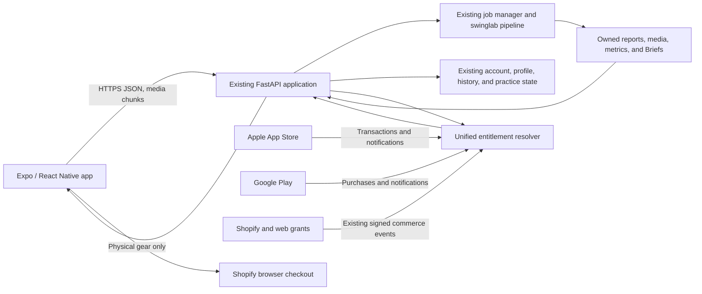

# CaddieInsight Native Mobile App Design

**Status:** Product design and written specification approved on 2026-08-06

**Implementation target:** iOS and Android from one Expo/React Native client

**Authoritative product repository:** `C:\Users\mahon\OneDrive\Desktop\SwingLab`

## 1. Summary

CaddieInsight will become a downloadable iPhone and Android application without
rewriting its swing-analysis engine or replacing its current web product. The
existing installable PWA remains available as the immediate beta and fallback.
A new Expo/React Native client will provide a native coach-first experience for
guided capture, video import, analysis status, Caddie Briefs, practice, matched
re-films, progress, account controls, and Pro billing.

The existing FastAPI/Railway application remains the system of record for
identity, golfer profiles, jobs, analysis, reports, practice evidence, history,
and entitlements. Apple App Store and Google Play purchases will join existing
web and Shopify grants in one source-aware entitlement ledger. Physical golf
gear remains a Shopify transaction and opens in Shopify's browser-hosted flow.
A narrow recovery-control exception stores an append-only, non-PII revocation/
erasure chain and cutover-baseline pointer at an independently protected off-
volume destination. It prevents an old SQLite backup from resurrecting revoked
credentials or erased data; it is not a migration of the database, reports,
media, jobs, or other canonical application state to object storage.

The first store release optimizes for coaching retention: a golfer completes an
analysis, understands one priority, performs the prescribed practice, records a
matched re-film, and returns for the next decision. Broader scoring, GPS, and
community functionality belongs to separately designed Pro phases after this
core loop is proven.

## 2. Approved product decisions

The interactive design review approved these decisions:

1. Ship both experiences in stages: keep the PWA available, then release through
   the Apple App Store and Google Play.
2. Version 1 exposes the complete existing CaddieInsight experience, while the
   coaching core is native and Shopify physical commerce remains browser-hosted.
3. Pro can later expand toward scoring, on-course intelligence, coach sharing,
   and private community features through separate designs.
4. Digital Pro purchases are available natively through Apple and Google.
5. Guided in-app recording and camera-roll video import are both supported.
6. Navigation is coach-first: **Today**, **Practice**, a prominent **Analyze**
   action, **Progress**, and **More**.
7. Beta success is coaching retention, not downloads or short-term revenue.
8. The implementation approach is Expo/React Native over the existing backend,
   not a packaged website and not two independently built native clients.

## 3. Goals

### 3.1 Customer goals

- Make recording a usable swing easier than the existing browser upload flow.
- Always tell the golfer what to do next instead of leading with a metric wall.
- Preserve one clear chain from evidence to practice to matched re-film.
- Let existing web members sign in and retain their current access.
- Let new mobile customers purchase and restore Pro without leaving the app.
- Make interrupted uploads, delayed analysis, and re-film requests understandable
  and recoverable.
- Keep gear relevant and optional; never claim that a product fixes a swing.

### 3.2 Product goals

- Prove that activated golfers return and complete a measurable coaching loop.
- Deliver an app with genuine native utility beyond the PWA: guided camera,
  interruption-safe uploads that pause in the background and reconcile/resume
  on foreground, secure device credentials, push completion, native billing,
  deep links, and platform-standard controls.
- Reuse the existing analysis and customer data rather than create parallel
  systems.
- Keep every mobile addition backward compatible with the current web routes,
  Railway container, and PWA until a separately approved migration changes a
  production contract.
- Establish native foundations that can support a later Pro on-course product
  without putting that larger scope into version 1.

## 4. Non-goals for version 1

- Rewriting the Python analysis engine in JavaScript, Swift, or Kotlin.
- Running pose analysis entirely on the phone.
- Replacing the CaddieInsight account system with Shopify Customer Accounts.
- Rebuilding Shopify cart and physical checkout natively.
- GPS course maps, automatic shot tracking, live scoring, strokes gained, an
  open social feed, chat, or public profiles.
- Unsupported clubface, ball-flight, launch-monitor, or 3D claims.
- Horizontal Railway scaling or a broad persistence migration without measured
  beta evidence and a separately reviewed cutover plan.
- Identical visual rendering between the PWA and native app. Product rules and
  customer data remain consistent; native interaction patterns may differ.

## 5. Information architecture

The signed-in app uses five primary destinations:

| Destination | Purpose |
| --- | --- |
| **Today** | One prioritized next action, current Caddie Brief, practice state, and matched re-film readiness. |
| **Practice** | The prescribed drill in 10-, 20-, or 45-minute form plus private evidence check-ins. |
| **Analyze** | Prominent center action opening guided camera or camera-roll import. |
| **Progress** | Owned history, comparable sessions, Proof of Change, and matched re-film outcomes. |
| **More** | Profile, Pro plan, Restore Purchases, gear, devices, privacy, export, history reset, account deletion, support, and legal pages. |

The app does not add a permanent Shop tab. A persistent commerce destination
would compete with the coaching action. Gear is available under More and can
also appear as a measured-result recommendation after the Caddie Brief.

## 6. Core user journey

### 6.1 Join and recover

1. The golfer selects **Continue with email**.
2. The app creates a one-time device challenge and asks the backend to send the
   existing passwordless email flow.
3. The email's universal/app link returns to CaddieInsight with a short-lived,
   single-use code bound to that challenge.
4. The app exchanges the code for a revocable device credential, stores it in
   the platform secure store, fetches `/api/v1/me`, and discards the challenge.
5. A linked existing account retains its profile, history, Shopify/web
   entitlement, and purchases. A new account proceeds to profile setup.

The current browser-based mobile-token issuance remains compatible for existing
clients, but native users never copy and paste a raw token. Re-authentication or
account recovery rotates the device credential. The account's existing
`auth_epoch` behavior continues to invalidate older credentials after ownership
recovery.

Store review is the only exception to the normal one-time-code UX. Each provider
gets its own synthetic user and reusable, protected review-only credential so a
reviewer can bypass mailbox OTP/2-step friction. That credential can issue only a
provider-, build-, installation-, and review-access-scoped bearer for its matching
synthetic user. Its account/password hash lives outside normal user credentials;
it never authenticates a real user or any browser, passwordless, OTP, or PWA path.
Apple credentials are bounded to the active submission window and revoked after
terminal review. Google keeps a standing Play App-access credential and demo
account valid while the public listing requires sign-in; each bearer is still
short-lived and build-scoped, and credential rotation is atomic with Play Console
readback. Permanent Google cleanup requires delisting/App-access-field clearance,
not merely one review becoming terminal. Neither provider affects the other.
Review privacy controls re-verify this dedicated credential through a separate
short-lived PKCE step-up because the synthetic account cannot receive email. If a
reviewer deletes the synthetic account, its current private-data generation is
recovery-fenced and purged; the provider credential survives independently, and a
later still-authorized review login creates a fresh isolated synthetic generation
from the immutable demo fixture. Review instructions disclose this special demo-
account behavior. A real golfer account never regenerates after deletion.

### 6.2 Profile setup

Required profile fields remain display name, goal, and preferred club, matching
the existing server/browser `is_complete` contract. Experience level,
handedness, camera angle, practice duration, handicap range, and reduced-motion
preference personalize defaults. Marketing consent remains separate and
unchecked. Camera, media-library, and notification permissions are requested
only when the corresponding feature is used.

### 6.3 Today

Today renders a server-provided next action, not a client-invented plan. It may
ask the golfer to:

- record a first baseline;
- resume or start the prescribed practice;
- log a practice check-in;
- record a matched re-film;
- review a completed Caddie Brief;
- inspect an inconclusive or no-transfer result; or
- take an explicit coach-handoff action.

An always-visible Analyze action permits a new swing without hiding the current
priority. The app warns when a changed club, hand, or camera angle will begin a
new comparison context.

### 6.4 Guided capture and import

The default capture flow uses the rear camera and includes:

- face-on or down-the-line selection with the current measurement boundary
  stated before recording;
- club and handedness confirmation;
- a full-body framing silhouette, horizon/phone-orientation cue, camera-distance
  guidance, and an audible countdown;
- a default three-swing recording session suitable for the existing strike
  detector, with the server capability response defining the hard limit;
- review, discard, or upload controls; and
- an alternative camera-roll video picker.

Version 1 does not promise real-time pose validation. The overlay provides setup
guidance; the existing analysis trust gates decide whether a clip supports
coaching. Imported files remain subject to the backend's configured size,
duration, strike-count, and media-format limits. The app reads those limits from
server capabilities rather than hardcoding deployment values.

### 6.5 Upload and analysis

Before network transfer, the app verifies required metadata, readable local
media, duration, byte size, and available connectivity. Mobile uploads use a
resumable upload session:

1. Create an owned upload session with an idempotency key and media metadata.
2. Transfer checksummed chunks and persist acknowledged offsets locally.
3. Resume after a network interruption or app restart without creating a
   duplicate analysis.
4. Complete the upload, verify the full digest server-side, and atomically create
   one analysis job.
5. After upload completion, retain the protected local source while analysis is
   queued/running or a failure is still server-declared retryable; delete it only
   after success, re-film, permanent failure, bounded retry expiry/exhaustion, or
   explicit discard. The server includes immutable source media for queued,
   running, and retryable-failed jobs in recoverable backup scope, so one
   acknowledged upload does not depend solely on the phone.

Incomplete upload sessions count against a small per-account active-upload limit,
expire after 24 hours, and are cleaned on startup and by the existing maintenance
loop. They do not consume an analysis allowance until one job is created. Chunk
size is server-configured so it can change without an app-store release.

The app displays queued, running, needs-re-film, done, failed, and expired
states. It can leave the screen while the job runs. A generic push notification
deep-links to the owned result when ready; it contains no swing metric or other
sensitive coaching detail.

### 6.6 Caddie Brief, practice, and re-film

A successful coaching-ready result leads with one priority, supporting evidence,
confidence, a plain-language hypothesis, the prescribed drill, and a measurable
re-film target. Raw metrics and visual evidence remain available below the
decision rather than replacing it.

Practice offers 10-, 20-, and 45-minute forms of the same prescribed experiment.
A private check-in can record reps, feel, relative strike, start line, and miss
pattern. A matched re-film requires the same club, handedness, and camera angle.
The comparison outcome uses the established product language: improved and
holding, early signal, inconclusive, or no transfer yet, followed by continue,
adjust, stop, or coach handoff.

### 6.7 Progress and gear

Progress groups sessions by comparable context and separates general activity
from evidence that a prescribed intervention changed. Gear appears only after a
relevant result and is described as supporting the drill, never fixing the
swing. A native recommendation card may use the existing backend/Shopify catalog
adapter; product detail, cart, and physical checkout open the Shopify storefront
in a platform browser surface. CaddieInsight does not imply shared browser login
when Shopify requires its own customer session.

## 7. Free and Pro scope

The server remains authoritative for plan capabilities and quota values. The
client must render capabilities returned by the API rather than duplicate plan
rules.

### All authenticated accounts

- Normal passwordless sign-in on another owned device, device list/revocation,
  sign-out, and provider management.
- Restore Purchases even when the current account is Free/lapsed, purchase
  admission is off, or an existing store entitlement has not yet been recognized.
- Regulatory/account privacy data export, swing-history reset, and account
  deletion. These are account controls and are never a Pro report-export benefit.

### Free

- Account, golfer profile, Today, and guided recording/import.
- The configured free analysis allowance.
- One Caddie Brief, basic owned history, prescribed practice, and a re-film
  checkpoint permitted by current server policy.
- Gear recommendations when relevant.

### Pro

- The configured higher analysis allowance.
- Full practice program and evidence check-ins.
- Matched comparisons, deeper progress, and any enhanced coaching/report export
  surfaces the server enables, distinct from privacy data export.
- Eligibility for later, separately released on-course functionality.

The app does not create feature claims that the backend cannot fulfill.

## 8. System architecture



### 8.1 Mobile application

The mobile client lives in `mobile/` in this repository. It uses TypeScript,
Expo Router, Expo Camera, ImagePicker, SecureStore, Notifications, and EAS build
profiles. Feature code is organized by product boundary rather than by screen
type:

```text
mobile/
  app/                  Route composition and deep-link entry points
  src/api/              Typed transport, auth, retries, and contract adapters
  src/features/auth/
  src/features/today/
  src/features/capture/
  src/features/analysis/
  src/features/practice/
  src/features/progress/
  src/features/billing/
  src/features/gear/
  src/platform/         Secure storage, notifications, connectivity, telemetry
  tests/
  app.config.ts
  eas.json
```

The client contains presentation and device behavior, not swing-analysis or
entitlement business rules. API data is cached only through a single owned data
layer so account/history invalidation can clear it consistently.

### 8.2 Backend and API

The current `swinglab.web.app.create_app` remains the composition root. Mobile
work extracts focused versioned routers and serializers from the large web
module as needed, without changing current URLs or response shapes. Existing
safe resources are reused and additive native serializers isolate browser-only
diagnostics:

- `/api/v1/me`;
- golfer profile plus native `GET /api/v1/mobile/today`;
- owned sessions and Caddie Briefs through
  `GET /api/v1/mobile/sessions` and
  `GET /api/v1/mobile/sessions/{session_id}`;
- practice check-ins;
- current mobile-device lifecycle records.

Legacy browser `/api/v1/today`, `/api/v1/sessions`, and session-detail/status
routes remain byte-for-byte compatible, but the native client never calls them
because their browser contract may contain raw diagnostic log/error fields.

Additive versioned resources provide native authentication exchange, resumable
upload sessions, device push-token registration, app capabilities, and native
billing reconciliation. FastAPI's OpenAPI document generates checked-in
TypeScript response/request types; a small hand-written transport layer owns
authentication, idempotency, retries, and error translation.

Every retryable mobile mutation uses either a stable `Idempotency-Key` or an
explicitly tested protocol-specific conditional/idempotent contract (for example,
upload offset plus checksum). Database uniqueness, preconditions, and transaction
boundaries—not only client behavior—prevent duplicate jobs, practice records,
device registrations, and entitlement events.

### 8.3 Production state boundary

The retention beta preserves the current one-replica Railway, SQLite, local
session-artifact, injected `PORT`, and root-Dockerfile contract. Mobile work adds
queue, disk, upload, and processing telemetry before increasing traffic. Broad
release is blocked if measured load exceeds safe capacity. Moving canonical
artifacts to object storage, jobs to durable leases, or records to Postgres
requires a separately approved migration and rollback design.

The approved exception is a least-privilege, append-only recovery-fence control
store containing canonical non-PII HMAC records, an immutable chain head, and the
verified cutover backup lineage/checkpoint. Setup is separately approval-gated
and must prove conditional put/readback, head compare-and-swap/readback, full-
chain recovery, and scratch restore before protected routes activate. Once any
fenced credential/erasure state exists, successful head/chain readback is a
permanent startup and restore prerequisite for the whole service; feature flags
cannot downgrade to local-only success. Ordinary backup bundles and all media/
database truth stay under the existing topology.

## 9. Authentication and device lifecycle

- CaddieInsight identity remains authoritative. Shopify customer records link
  commerce but do not authenticate the native app and do not receive golf data.
- An ordinary golfer native credential is issued only after the existing email
  ownership proof completes through a one-time, challenge-bound app link. The
  provider-scoped synthetic review exception is the dedicated PKCE credential
  flow in §6.1 and cannot authenticate a real user.
- The raw credential is returned once, stored only in SecureStore/Keychain, and
  never logged, synced to analytics, or placed in general application state.
- Native credentials remain account-owned, individually revocable, limited in
  count, time-bounded, and bound to the existing authentication epoch.
- Password reset or ownership recovery invalidates prior device credentials.
- Sign-out erases the device credential, cached private data, pending push token,
  and locally staged media after asking how to handle an unfinished upload.
- More lists connected devices and supports individual revocation.
- Account deletion is available in the app and uses the established deletion and
  Shopify privacy behavior.

## 10. Native billing and unified entitlements

### 10.1 Store product surface

Version 1 sells a monthly and an annual auto-renewing Pro plan through the native
store sheet. Store product metadata supplies localized title, price, currency,
trial, renewal, and legal details; the app does not hardcode price copy.
Existing Season Pass and Founders Pass holders retain their current entitlement
after sign-in. Version 1 does not advertise or link to a web-only digital offer
inside the native app.

Physical products remain Shopify payments. Native digital billing is never used
for clubs, training aids, apparel, shipping, or other physical goods.

### 10.2 Entitlement ledger

The backend records immutable, idempotent source events and derives current Pro
access from them. Each grant identifies its source (`apple`, `google`,
`shopify`, or existing web billing), external transaction/event identifier,
product, original purchase identity where applicable, state, purchase time,
paid-through time, cancellation/refund/revocation state, and verification time.
Raw store secrets and full payment instruments are never stored.

An account is Pro while any verified source grants active access. When grants
overlap, access continues through the latest valid paid-through time; the app
shows which provider manages renewal. Before presenting a purchase action, the
app fetches current entitlement and offers management/restore instead of
encouraging a duplicate subscription.

Apple and Google transactions are verified server-side and reconciled from
their signed server notifications. A client-reported purchase can enter a
short-lived **Confirming** state but does not become authoritative until backend
verification succeeds. Restore Purchases replays owned transactions through the
same idempotent path. Cancellation stops future renewal but preserves access
through the paid period. Refund or revocation removes only that source grant and
never deletes the golfer's account or history.

Billing outages do not block free features. Store-management links use the
platform's subscription-management surface.

During Apple's bounded review window or Google's standing App-access lane, the
matching review-scoped bearer gets a
request-scoped Pro demo capability overlay so reviewers can inspect every gated
feature without paying. The overlay is not an entitlement event, grant, purchase
binding, renewal source, or transferable account state. Apple sandbox and Google
provider-authoritative test-purchase verification remain separate, independently
enabled isolated billing paths. Controlled Google License Testing proves the
integration before submission and is closed before public review; the final
Google reviewer gets demo access with purchase testing off because its Play OS
identity is not the supplied app login. Apple may independently retain its
sandbox purchase-review path.

The client uses a maintained StoreKit 2 and Google Play Billing bridge, while the
backend verifies both stores directly. A third-party subscription aggregator is
not part of version 1 unless a separate review approves its cost, data handling,
failure boundary, and migration/exit plan.

## 11. Offline and local-data boundary

Native offline support is intentionally narrow:

- A recorded or imported source may remain in app-private, backup-excluded local
  storage through upload, queued/running analysis, and a bounded retryable-failure
  window. It is deleted after success/re-film, permanent or exhausted/expired
  failure, or a server-confirmed explicit discard. Platform file protection is
  enabled wherever supported.
- Upload offsets and non-secret job identifiers persist so interrupted work can
  resume. Version 1 does not promise continued transfer while the app is
  backgrounded: the current bounded chunk is canceled, durable state is saved,
  and the server offset is reconciled before foreground resume.
- The active drill, practice timer/checklist, and an unsent practice check-in may
  work offline and sync idempotently later.
- Full reports, personal video, account pages, purchase state, and current
  entitlement require the network.
- A `history_epoch` change clears all cached session, Brief, practice, progress,
  and ordinary pending-write state before refetch. The only exception is the
  bounded same-account reset replay envelope—purpose, original non-secret body,
  and idempotency key with no coaching data—which survives only to recover an
  already accepted lost terminal response and then deletes itself.
- Before any credential/private-state read, API call, deep-link handling, or
  private render, the app compares its immutable build environment and canonical
  backend origin with a prior-install marker. A missing or changed marker starts
  a crash-resumable fail-closed purge of credentials, operation envelopes,
  staged media, cache, and installation identity, then requires fresh sign-in.
  This prevents the shared store identity used by beta/production updates from
  carrying staging data or credentials into production (or the reverse).
- Device backups exclude credentials, staged swing media, and private caches.

The app never presents stale cached content as a current coaching or billing
decision.

## 12. Failure handling

| Condition | User message and behavior | Recovery |
| --- | --- | --- |
| Camera permission denied | Camera is unavailable; import remains available. | Open Settings or import a video. |
| Media permission denied | Explain why original-video access is needed. | Retry permission or use guided capture. |
| Invalid/oversize/overlength media | State the specific server-provided limit before upload. | Choose another clip or record a guided clip. |
| Weak/offline connection | Preserve local media and acknowledged chunks; create no duplicate job. | Resume automatically or on Wi-Fi. |
| App closes during upload | Restore the upload session and progress from durable local state. | Continue, discard, or retry expired session. |
| Upload digest mismatch | Reject completion and retain local source for one clean retry. | Restart the upload; repeated failure offers support. |
| Queue delay | Show queue position and allow leaving the screen. | Push/deep-link on completion. |
| Poor framing or low confidence | Withhold unsupported coaching and explain the capture problem. | Open the exact guided re-film checklist. |
| Retryable analysis failure | Show the bounded server failure code and retry window; retain protected local/server source and preserve no false result. | Retry the same job idempotently before expiry, re-upload if restore lost only the server source, or discard explicitly. |
| Permanent/exhausted analysis failure | Translate the bounded error, preserve no false result, and release retained source under the documented policy. | Record again or contact support with a non-sensitive reference ID. |
| Purchase verification delay | Show **Confirming** and keep free features available. | Retry reconciliation or Restore Purchases. |
| Existing external membership | Recognize the active source before offering a new purchase. | Show provider-specific management instructions. |
| Expired/revoked credential | Clear private cache and explain that ownership must be verified again. | Continue with email. |
| Server unavailable | Keep safe local state and distinguish service outage from bad video. | Retry with bounded backoff and status messaging. |

## 13. Privacy, security, and customer control

- Camera, microphone, photo-library, and notification permissions are
  just-in-time and have plain-language purpose strings.
- The app requests no location permission in version 1.
- Uploaded swing video, reports, and practice evidence are private account data.
- Push payloads contain no names, swing metrics, or private result text.
- Telemetry excludes email, raw video, report content, metric values, device
  credentials, and advertising identifiers.
- All owned resources enforce server-side account authorization; a client-side
  hidden route is not an access control.
- Native auth codes are short-lived, single-use, challenge-bound, and redacted
  from logs and analytics.
- Apple/Google and Shopify webhook signatures are verified before an event is
  written. Replay protection is persistent.
- The user can revoke devices, sign out, restore purchases, export data, delete
  swing history, and delete the account from More.
- The privacy policy and store privacy disclosures enumerate camera/media use,
  analysis processing, retention, billing providers, push delivery, telemetry,
  and deletion behavior.

## 14. Notifications and deep links

The app first asks for notification permission after the golfer submits an
analysis or explicitly enables reminders. Version 1 supports:

- analysis completed;
- analysis needs a re-film;
- optional practice reminder chosen by the golfer; and
- device/account security notice when appropriate.

Notification content is generic. Deep links route through authenticated app
navigation and re-check ownership on the server. Universal/app links also cover
email sign-in, owned analysis/Caddie Brief destinations, and store-review-safe
public landing pages. Invalid, expired, or cross-account links open a safe
explanation, not partial private data.

Version 1 uses Expo Notifications and the Expo Push Service behind a backend
adapter. Only generic payloads leave CaddieInsight. Expo push tokens are treated
as device identifiers, deleted on sign-out/account deletion, and disclosed in
the privacy policy. The adapter permits later direct APNs/FCM delivery without
changing product code or notification semantics.

Preview and production use the same public store application identity and the
same Version 1 EAS project, so an Expo push token can survive an in-place app
upgrade. Local environment purging is not a server-side revocation. Therefore
staging push is a single bounded prelaunch proof lane: every message has an exact
15-minute TTL, and before a production install can register or production push
can enable, staging closes enqueue/send admission, drains guarded provider work,
waits the full TTL plus clock-skew allowance after its last accepted send,
recovery-fences and purges its registrations/outbox, and revokes its Expo sender
credential. The upgraded client also dismisses presented notifications, cancels
scheduled notifications, and clears the last response before adopting the new
environment marker. A physical preview-to-production upgrade must prove the same
token cannot be targeted by staging and can be registered only with production.
Staging remains polling-only while Version 1 production is public; reopening
preview push requires a separately designed isolated token namespace and release
gate.

## 15. Telemetry and success measures

The current PII-minimized event ledger is extended with native platform, app
version, and coarse reliability context. It records funnel transitions without
video, swing measurements, or email addresses.

### 15.1 Reliability release gates

- At least 99.5% crash-free sessions across supported beta devices.
- At least 95% upload completion excluding explicit user cancellation.
- Purchase, restore, renewal, cancellation, refund, revocation, and existing-web
  recognition reconcile correctly for every beta test transaction.
- Zero duplicate charges or duplicate jobs from retries.
- Zero confirmed cross-account data exposure.
- Zero unresolved critical security, privacy, billing, or data-loss findings.
- Queue, processing, disk, and upload measurements remain within the current
  single-replica operating envelope throughout the controlled cohort.

### 15.2 Product signal

For activated beta golfers:

- at least 50% of first-Brief viewers start the prescribed practice;
- at least 30% of practice starters complete a matched re-film within 14 days;
  and
- at least 25% return in week two for a meaningful coaching action.

Reliability and privacy are hard release gates. Missing a product target causes
iteration and another controlled cohort; it never justifies an unsafe launch.

## 16. Testing strategy

### 16.1 Backend and contract tests

- Stable `/api/v1` response schemas and generated TypeScript types.
- Native authentication expiry, one-time use, challenge binding, rotation,
  revocation, account recovery, and redaction.
- Resumable upload offsets, digest verification, expiry, cleanup, idempotent
  completion, quota behavior, and duplicate prevention.
- Entitlement precedence, overlapping sources, receipt verification, event
  replay, purchase/restore/renewal/cancel/refund/revoke, and outage recovery.
- Push-token ownership, rotation, deletion, and privacy-safe payloads.
- Existing browser, API, CLI, Shopify, and deployment contract regression tests.

### 16.2 Mobile unit and component tests

- Coach-first navigation and server-driven Today states.
- Permission denial and alternative paths.
- Capture metadata and preflight validation.
- Upload/job state persistence and recovery.
- Auth cache clearing, environment-boundary purge, and `history_epoch`
  invalidation.
- Free/Pro capability rendering without hardcoded plan rules.
- Accessibility labels, text scaling, reduced motion, contrast, and keyboard or
  switch-friendly interactions where the platform supports them.

### 16.3 Real-device and end-to-end tests

Test representative current and minimum-supported iPhone and Android devices for:

- rear-camera recording, library import, portrait/landscape rotation, common
  codecs, limited media permission, low storage, and denied permissions;
- Wi-Fi-to-cellular transitions, slow connection, airplane mode, app background,
  forced termination, upload resume, and push deep links;
- email-link sign-in on the same device and a second device;
- complete analysis through Brief, practice, matched re-film, and progress;
- native sandbox purchase, restore, renewal, cancellation, refund, revocation,
  existing web membership, and duplicate-purchase prevention;
- Shopify product handoff and physical checkout without presenting a digital
  web-payment path; and
- export, swing-history reset, sign-out, device revocation, and account deletion.

Every production-review build submitted to a store provides a visible review-
access path, precise review notes, reachable support/privacy URLs, current
screenshots, and a reviewer-accessible production backend. Internal preview
builds use the isolated staging backend and are never represented as submission
builds. Apple and Google use different synthetic app accounts,
different reusable credential records, different review-scoped bearers, and
isolated intent/grant namespaces; they never share an app user identity. Each
matching account receives temporary Pro demo access
without a purchase. Store-review sandbox/test purchases are separately verified
only for that provider's synthetic app identity, exact build, and bounded review
window. No review credential or demo capability can bind or grant access to a
real customer or affect the other provider. Apple review state is reconciled and
purged before Apple ordinary purchase admission/publication. Google controlled
License Testing and isolated purchase state are closed and purged before Google
submission/publication, but its purchase-disabled demo credential, account, and
Play App-access instructions remain continuously valid while the listing is active.

## 17. Release stages and rollback

### Stage 0: PWA baseline

Keep the installable PWA available and measure the existing funnel. No customer
migration or native-store dependency is introduced.

### Stage 1: Native foundation

Build native auth, app shell, coach-first surfaces, capture/import, resilient
upload, push, and unified entitlements behind server flags. Store purchases use
sandbox/test tracks only.

Before enabling any credential revocation, browser/native erasure, or Shopify
privacy path that depends on the recovery fence, separately approve/provision
the control store, stop the service for the cutover-baseline backup/chain drill,
and read back the accepted baseline. Retain older bundles as audit evidence but
reject them for service restoration; this step does not move canonical app state.

### Stage 2: Internal alpha

Use TestFlight internal testing and Google Play internal distribution across the
device matrix. Validate every failure and billing lifecycle before inviting
customers.

### Stage 3: Retention beta

Invite 30–75 golfers through controlled TestFlight and Play testing. Do not buy
traffic. Evaluate the hard reliability gates and coaching-retention signals.

### Stage 4: Public store release

Submit complete builds and use gradual rollout only where the provider supports
it for that release type. Version 1 uses one manually approved launch to the
preapproved storefront/country set when first-release percentage controls are not
available; staged/phased percentages are reserved for later updates. Preserve the
PWA and prior backend contract as rollback paths. Server flags can disable native
purchases, push, resumable uploads, or individual screens without disabling the
web product.

Report release state separately:

1. design/implementation branch and commit;
2. GitHub `main` merge;
3. Railway backend deployment and health;
4. PWA/public web state;
5. Apple review approval and public App Store availability; and
6. Google review approval and public Play Store availability.

Store approval is not publication, and backend deployment is not mobile release.

## 18. Later Pro expansion

Later Pro work is split into independent specifications:

1. **Transfer Journal:** lightweight manual range/round outcomes for strike,
   start line, miss pattern, confidence, and whether the prescribed change held.
   This is the first expansion because it directly completes Proof of Transfer
   without GPS or course-data dependencies.
2. **On-course intelligence:** scorecard, licensed course data, GPS, offline round
   state, battery-aware tracking, club outcomes, and post-round decisions. This
   requires a separate architecture, location-privacy, data-license, and
   reliability review.
3. **Coach and community:** explicit evidence-pack sharing, coach feedback,
   selected challenges, and private groups. An open feed is not the default.
   Consent, moderation, reporting, blocking, retention, and youth-safety rules
   must be approved before implementation.

Every expansion must strengthen this sequence:

> intervention → practice → matched re-film → on-course transfer → next decision

It must not become a generic score, social vanity surface, or unsupported golf
claim.

## 19. Acceptance criteria

The version 1 design is implemented when all of the following are true:

- One Expo/React Native project builds signed iOS and Android artifacts from
  reproducible build profiles.
- New and existing members complete native email-link sign-in without copying a
  token, and device revocation/recovery invalidates access correctly.
- A golfer can record with guidance or import a video, survive interruption,
  upload once, leave during analysis, and open the completed owned result.
- Today, Caddie Brief, Practice, Progress, Profile, and account controls use
  existing server truth and preserve measurement boundaries.
- Matched re-film preserves club, hand, angle, and target context and produces
  the existing confidence-labeled outcome/decision language.
- Apple and Google monthly/annual Pro purchases, restore, renewal, cancellation,
  refund, and revocation reconcile with existing web/Shopify entitlements without
  duplicate purchase pressure.
- Relevant physical gear can be discovered from the app and completed through
  Shopify without mixing physical and digital payment paths.
- All documented failure states have tested recovery paths and no retry produces
  duplicate jobs, charges, or practice records.
- Privacy controls, export, history reset, account deletion, and store disclosures
  are accessible and verified.
- Backend/PWA compatibility, security, real-device, store-sandbox, and end-to-end
  tests pass, and the controlled beta satisfies every hard reliability gate.
- Public availability is reported independently for GitHub, Railway, web/PWA,
  Apple, and Google.

## 20. Current references and policy boundary

Implementation and release must re-check current platform documentation because
store rules and SDK behavior can change:

- [Apple App Review Guidelines](https://developer.apple.com/app-store/review/guidelines/)
  — digital purchases, physical goods, minimum functionality, privacy, and
  account deletion.
- [Google Play Payments policy](https://support.google.com/googleplay/android-developer/answer/9858738)
  — digital Play Billing and the physical-goods exception.
- [Expo Camera](https://docs.expo.dev/versions/latest/sdk/camera/),
  [ImagePicker](https://docs.expo.dev/versions/latest/sdk/imagepicker/),
  [SecureStore](https://docs.expo.dev/versions/latest/sdk/securestore/), and
  [EAS Build](https://docs.expo.dev/build/introduction/).
- Existing repository contracts in `README.md`, `docs/architecture.md`,
  `docs/mobile-api-tokens.md`, `docs/first-sale-launch.md`, and
  `docs/operations/backup-recovery.md`.

This specification authorizes design and implementation planning. It does not
authorize production secrets, store-account enrollment, paid services, public
store submission, Shopify mutations, Railway deployment, or public release.
